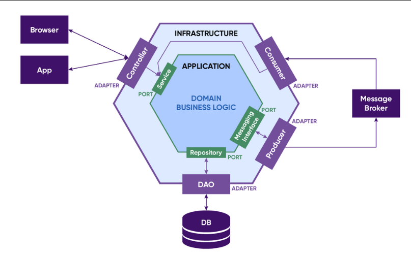

# Hexagonal-Architecture

헥사고날 아키텍처 구현해보기

---

## 📚 헥사고날 아키텍처란?

**헥사고날 아키텍처(Hexagonal Architecture)는 포트와 어댑터 아키텍처(Ports and Adapters Architecture)** 라고도 불리며, 

어플리케이션의 핵심 비즈니스 로직을 외부 시스템(데이터베이스, 웹, 메시징 시스템 등)으로부터 **완전히 분리**하여 독립성을 높이는 클린 아키텍처 패턴 중 하나입니다.

어플리케이션의 도메인 로직이 외부 의존성과 분리됨으로써, **유연성**과 **테스트 용이성**을 크게 향상시킬 수 있습니다.

 

### 아키텍처 구조

이 구조는 도메인이 항상 **중심에 위치**하고, 외부 시스템과의 상호작용이 포트와 어댑터로 분리되는 형태로 동작합니다.

 

1. **도메인 중심 설계(Domain-Centric Design)**:
    - 어플리케이션의 **핵심 비즈니스 로직**을 중심으로 설계되고, 외부 시스템(데이터베이스, API 등)에 대한 의존성을 최소화 합니다.

2. **포트(Ports)**:
    - 도메인에서 외부와의 상호작용을 정의하는 **인터페이스**. 입력 포트는 외부에서 들어오는 데이터를 처리하고, 출력 포트는 외부 시스템에 데이터를 전달합니다.

3. **어댑터(Adapters)**:
    - 포트에 정의된 인터페이스를 실제로 구현하는 **구현체**. 예를 들어, 데이터베이스와 상호작용하는 어댑터는 `JPA` 또는 `JDBC`로 구현될 수 있습니다.

4. **유연한 의존성 관리**:
    - 어플리케이션의 비즈니스 로직은 외부 기술 스택(JPA, REST, Messaging 등)에 의존하지 않기 때문에, 필요에 따라 쉽게 기술 스택을 교체하거나 변경할 수 있습니다.

---

## 📚 헥사고날 아키텍처를 사용하는 이유

### 1. **비즈니스 로직의 독립성 강화**

헥사고날 아키텍처는 비즈니스 로직을 외부 시스템과 분리하여 **비즈니스 로직의 순수성**을 유지합니다.

이를 통해 기술적 구현체(JPA, 메시징 시스템, API 등)에 영향을 받지 않고 비즈니스 로직을 설계할 수 있습니다.

 

### 2. **유연한 변경 및 확장성**

어플리케이션의 특정 구현체(JPA, 메시징 시스템 등)를 다른 기술로 **쉽게 교체**할 수 있습니다.

포트와 어댑터를 통해 외부 시스템과 도메인 로직이 명확히 분리되어 있기 때문에, 새로운 요구사항이나 기술 스택 변경에도 유연하게 대응할 수 있습니다.

 

### 3. **테스트 용이성**

비즈니스 로직이 외부 시스템에 의존하지 않기 때문에, 테스트할 때 **목(Mocks)**을 쉽게 사용할 수 있습니다. 

이로 인해 단위 테스트와 통합 테스트를 더 쉽게 작성할 수 있고, 외부 시스템과의 상호작용 없이도 비즈니스 로직을 테스트할 수 있습니다.

 

### 4. **유지보수성**

도메인 로직이 외부 기술과 분리되어 있기 때문에, 유지보수가 더 쉬워집니다. 

비즈니스 로직에 집중하면서도 외부 시스템(데이터베이스, API 등)에 대한 변경은 어댑터에서만 처리하면 되기 때문에, 전체 어플리케이션의 변경 범위를 줄일 수 있습니다.

---

## 📚 기존 Layered Architecture 와의 차이점

헥사고날 아키텍처와 기존 **레이어드 아키텍처(Layered Architecture)** 사이에는 몇 가지 중요한 차이점이 있습니다.

### 1. **의존성의 방향**

- **레이어드 아키텍처**에서는 일반적으로 하위 레이어가 상위 레이어를 호출하지 못하지만, 상위 레이어는 하위 레이어를 호출하는 **단방향 의존성**을 갖고 있습니다.
- 주로 컨트롤러 → 서비스 → 레포지토리의 방향으로 호출이 이루어집니다.
- **헥사고날 아키텍처**에서는 도메인이 외부 시스템(레포지토리, API 등)과의 의존성을 가지지 않습니다.
- 도메인은 외부와의 상호작용을 포트를 통해 추상화하고, 어댑터가 포트를 구현합니다.
- 즉, **의존성의 방향이 외부로부터 도메인으로 역전**됩니다.

 

### 2. **비즈니스 로직의 위치**

- **레이어드 아키텍처**에서는 비즈니스 로직이 서비스 계층에 위치하고, 서비스는 레포지토리나 다른 외부 시스템에 강하게 의존합니다.
- **헥사고날 아키텍처**에서는 비즈니스 로직이 **도메인 계층**에 위치하며, 외부 의존성 없이 비즈니스 규칙만을 다룹니다.
- 비즈니스 로직이 도메인에 집중되고 외부 기술에 종속되지 않기 때문에, 더 유연하고 유지보수하기 더 쉽습니다.

 

### 3. **외부 시스템과의 연결**

- **레이어드 아키텍처**에서는 특정 기술(JPA, REST API 등)이 서비스나 레포지토리 계층에서 직접적으로 사용되기 때문에, 기술 변경 시 서비스 계층의 코드도 변경될 가능성이 높습니다.
- **헥사고날 아키텍처**에서는 외부 시스템과의 연결이 어댑터를 통해 구현되며, 도메인 로직은 기술적인 세부사항을 전혀 알 필요가 없습니다.
- 기술 스택을 변경할 때도 어댑터만 수정하면 되기 때문에 더 유연합니다.
